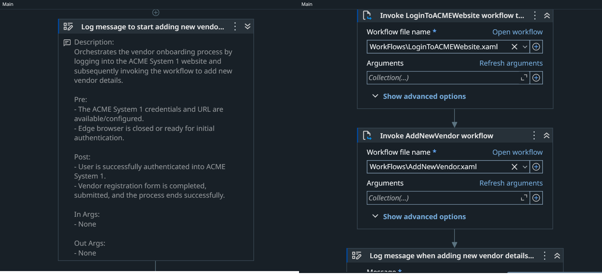
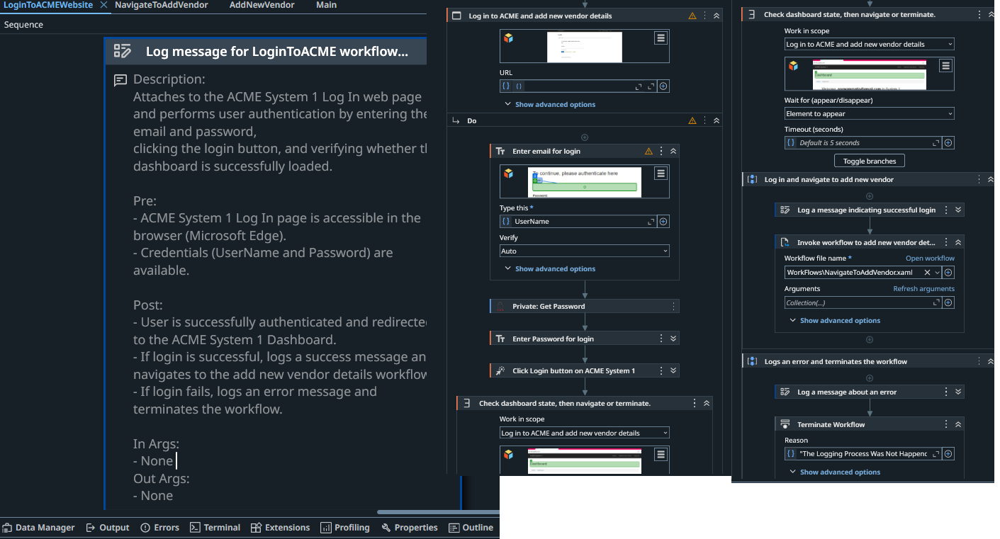
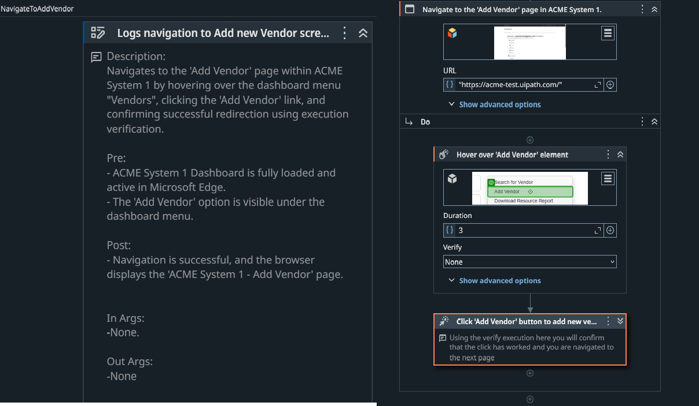
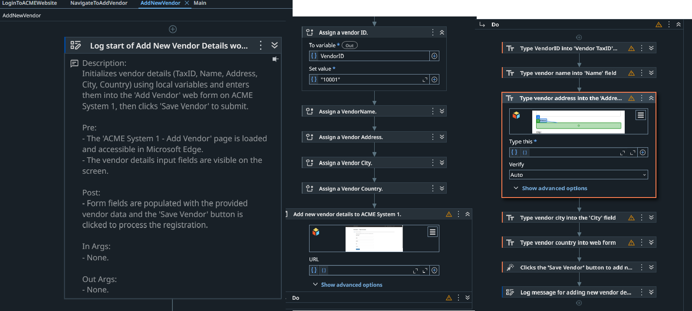

# UiPath Vendor Onboarding Automation.

## Overview
This project automates the process of adding new vendor details into the ACME System 1 website using the UiPath Modern Design Experience. It ensures that the user is authenticated before proceeding and validates that data entry is executed accurately.

## The automation:
- Checks the application state to verify ACME System 1 login status.
- Handles authorization exceptions if the user is logged out.
- Navigates to the Add Vendor section.
- Enters specific vendor details using optimized modern activities.
- Verifies successful execution and submission of the form.

## Technologies:
- Modern Design Experience (UI Automation Next).
- Check App State & Verify Execution (Auto Verification).
- Web Automation (Microsoft Edge).
- Dynamic & Fuzzy Selectors.
- Anchor-Based Targeting.

## Workflow Process:
- Check if the user is logged into the ACME System 1 page.
- If Not Logged In: Log an error message and safely terminate/stop the process.
- If Logged In: Navigate to Vendors > Add New Vendor section.
-Input the following predefined vendor details into the web form:
   - Vendor ID: "10022"
   - Vendor Name: "Ironman Inc"
   - Vendor Address: "1 MG Road"
   - Vendor City: "Bengaluru"
   - Vendor Country: "India"
- Verify that the vendor details are entered and submitted successfully using UI verification.

## Workflow Architecture:

```
├── WorkFlows/
│   ├── AddNewVendor.xaml
│   ├── LoginToACMEWebsite.xaml
│   └── NavigateToAddVendor.xaml
└── Main.xaml
```

## Technical Challenges & Solutions:

**Challenge 1: Dynamic Login & Authentication Check**

 - The robot needs to ensure it is on the authenticated dashboard before trying to navigate to the vendor form; otherwise, the workflow will fail due to missing elements.

**Solution:**

- Used the Check App State activity at the beginning of the process.

- Configured the workflow to branch out: if logged in, it proceeds; if not, it triggers a clean error log instead of unhandled element-not-found exceptions.

**Challenge 2: Ensuring Input Accuracy Across All Fields**
- When filling multi-field web forms rapidly, text inputs can occasionally drop characters due to browser lagging or page script latency, causing incomplete data submission.

**Solution**

- Utilized the Auto Verification (Verify Execution) feature natively for every single data input activity inside AddNewVendor.
- By setting the verification mode to auto-detect text appearance, the robot automatically confirms that each piece of vendor data (ID, Name, Address, City, Country) is        fully and correctly written into its respective field before proceeding to the next step.

**Challenge 3: Unstable Form Elements & Fields**
- Web elements on the ACME form can have slight variations in attributes, making strict selectors prone to failing over time.

**Solution**

- Leveraged Fuzzy Selectors combined with reliable text-based Anchors.
- Reduced reliance on absolute screen coordinates or raw Computer Vision.

### Example Selector Configuration:
```
XML

Target:
<webctrl id='vendorTaxId' tag='INPUT' type='text' class='form-control' />

Anchor:
<webctrl tag='LABEL' check:innerText='Vendor TaxID:' />
```

## Features:
✔ Modern Design Experience.

✔ Check App State Conditional Logic.

✔ Natively Automated Verify Execution (Auto-Verification).

✔ Fuzzy & Robust Selectors.

✔ Anchor-Based Element Targeting.

✔ Hardcoded/Local Variable Data Handling.

✔ Modular Workflow Design.

✔ Clear Workflow Annotations (Pre/Post Conditions).

## Screenshots:

### Main Workflow



### Login To ACMES




### Navigate To AddVendor




### Add New Vendor



## Demo
- Simple link:
(Watch the demo)[https://drive.google.com/file/d/1XKOMGH5yfN8OKgY27tmwwyI4rxFn0nTS/view?usp=sharing]
